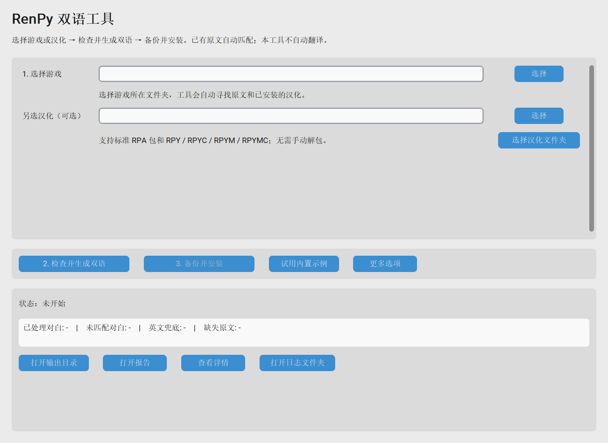

# Ren’Py Bilingual Builder

把已有的 Ren’Py 翻译与原文合并为双语对白，提供桌面界面、构建报告和带备份的安装流程。

A desktop tool for combining existing Ren’Py translations with their source text. It imports standard RPA archives and compiled Ren’Py scripts without launching the game, preserves module paths and dependencies, and provides recoverable builds and installation.



## Windows 便携版：解压后双击

面向 **Windows 10/11 64 位（x64）**。便携 ZIP 包含 Python、Tk、界面主题和字体、永恒世界专用补丁及原创示例，使用时不需要 Python、pip、命令行或联网。

1. [下载 Windows 便携 ZIP](https://github.com/railway02/renpy-bilingual-builder/releases/latest/download/RenPy-Bilingual-Builder-windows-x64.zip)，**完整解压**。
2. 双击 **`RenPy双语工具.exe`**，保留旁边的 `运行依赖文件` 文件夹。
3. 点击 **“试用内置示例” → “检查并生成双语” → “打开输出目录”**。

```text
RenPy双语工具/
├─ RenPy双语工具.exe
├─ 运行依赖文件/
└─ 使用说明.txt
```

示例是原创文本，预期生成 4 条双语对白。没有游戏文件也能完整体验构建；示例不能安装到游戏。
**支持标准 RPA 2/3、常见 RPYC/RPYMC 编译脚本和 RPY/RPYM 源脚本。加密、混淆、未知语法和非标准替换式汉化会停止并提示，不承诺处理所有游戏。**

源码 ZIP 不包含 EXE。维护者可按 [Windows 打包说明](packaging/README.md) 生成便携包；
[Windows portable 工作流](https://github.com/railway02/renpy-bilingual-builder/actions/workflows/windows-portable.yml) 成功后会提供含 ZIP 和 SHA-256 的构建产物（下载 Actions 产物需登录 GitHub）。

## 从源码启动（开发者）

需要 **Python 3.10 或更高版本**，以及 Tk 桌面组件。

### Windows 源码版

1. 下载本仓库的 ZIP 并解压，或使用 Git 克隆。
2. 安装 [Python](https://www.python.org/downloads/)，安装时启用添加到 PATH。
3. 双击项目中的 **`start_windows.bat`**。首次启动会建立 `.venv` 并联网安装界面依赖。
4. 点击 **“试用内置示例” → “检查并生成双语” → “打开输出目录”**。

### Linux / macOS

```bash
bash start.sh
```

Python 需要带有 Tk。Linux 缺少 Tk 时，按发行版方式安装 `python3-tk`；macOS 可使用带 Tk 的 Python 安装包。

也可以手动启动：

```bash
python -m pip install -r requirements.txt
python app/gui.py
```

## 给自己的游戏生成双语

1. **选择游戏／汉化**：选择游戏根目录或 `game` 文件夹。工具自动寻找原文和已安装汉化；也可在“另选汉化”选择 `.rpa`、脚本文件或完整汉化文件夹。
2. **检查并生成双语**：自动读取包、恢复编译脚本并匹配原文。多个汉化或语言候选会显示下拉框，需要用户明确选择后继续。
3. **备份并安装**：检查处理数量和报告，完全关闭游戏，再安装到此前检查的游戏。启动游戏后，在游戏设置中选择对应语言。

不需要自己解包或寻找英文脚本目录。只有单独汉化包、没有游戏时也可以生成；缺少可靠原文会保留译文并报告，安装前需选择目标游戏重新检查。
“更多选项”中可以选择输出位置和游戏配置。默认通用模式；永恒世界 0.9.5 中文排版为独立选项。
技术日志收在“查看详情”中；输入、候选、配置或输出改变后，需要重新生成。

普通导入模式的输出是一份**按游戏相对路径保存的安装包**：

```text
双语输出/
├─ game/                 # 双语脚本及汉化依赖，保持相对路径
├─ install-plan.json     # 安装文件清单、哈希和目标游戏信息
├─ provenance.json       # 原 RPA/文件名、包内路径、恢复标记及原文标识来源
├─ build-report.json
└─ diagnostics.csv
```

安装只覆盖清单中的松散文件，原 RPA 保持原样。字体、样式、Python/strings 块等随外部汉化包保留；
已在游戏中的资源继续保留在原处，不将原游戏媒体复制到翻译目录。
原文件及旧 `.rpyc/.rpymc` 备份到 `game` 外的 `renpy_bilingual_backups/`。
备份附有 `恢复说明.txt` 和 `restore-manifest.json`：删除本次新增文件及其编译缓存，按相对路径恢复 `original/` 中的文件。
导入之后若游戏脚本/包新增、删除或发生变化，安装会要求重新检查。

已有脚本目录的旧工作方式仍保留在“更多选项 → 原脚本模式”：可选择翻译语言目录和可选原文目录，
输出仍直接是语言目录，按原来的带备份方式安装到 `game/tl/<语言>`。命令行入口也继续保留。
原脚本模式的模块只有在源目录本来就是目标游戏的该语言目录时才能安装；其他模块请使用普通导入，避免把模块移到错误位置。

例如输入：

```renpy
translate spanish welcome_123:
    # guide "Welcome!"
    guide "¡Bienvenido!"
```

输出：

```renpy
translate spanish welcome_123:
    # guide "Welcome!"
    guide "Welcome!\n¡Bienvenido!"
```

## 通用模式与游戏适配

| 能力 | 通用 Ren’Py | 永恒世界 0.9.5 中文适配 |
| --- | --- | --- |
| 识别任意 `.rpy/.rpym` 文件名和子目录 | 支持 | 支持 |
| 目标语言 | 自动识别或指定 | `chinese` |
| 生成原文＋译文 | 支持 | 支持 |
| 游戏界面、字号 | 沿用原游戏 | 可安装专用文本框补丁 |
| 特效字号冲突修复 | 不注入专用字号包装 | 保留已验证的 `{sc}` / `{bt}` 兼容处理 |

通用模式根据标准翻译结构生成文本，不依赖《永恒世界》的角色、资源或 `persistent` 设置。
它不会自动调整其他游戏的文本框高度、字体或自定义屏幕；双语长句是否放得下仍需在游戏中检查。
已有译文的语言切换、字体支持和自定义文本效果仍由游戏负责。

**适用范围是标准 Ren’Py 翻译项目，不是所有游戏引擎。** 当前支持普通双引号对白、旁白、`extend`、`centered` 及其可识别的原文注释。

以下情况会保守保留原文并记录原因，或要求准备正确输入：

- 标准 RPA 2/3：只读索引，在隔离工作目录提取；拒绝路径穿越、Windows 文件名冲突和越界分段。
- RPYC/RPYMC：内置固定版本的 unrpyc 渲染库，由独立进程读取惰性语法对象，不运行游戏脚本。未知节点、恢复警告和损坏数据会阻止生成可安装结果。
- `.rpym/.rpymc`：源模块保持 `.rpym` 和原相对路径，绝不改名为 `.rpy` 或自动添加加载调用。
- 加密/混淆包、嵌套 RPA、没有标准 `translate` 块的整段中文替换：本版不支持；请提供标准汉化包或源文件。
- 同名 `*_ren.py` 会被引擎优先加载的翻译暂不转换，避免生成被游戏忽略的双语文件。
- 自动导入仅按可靠翻译标识或紧邻的原文注释配对；编译原文优先读取 RPYC slot 2 标识，源文件支持显式 `id`/原文翻译块。原始源码没有可靠标识且没有原文注释时，不凭恢复后的行号或相邻台词猜测。
- 相同标识对应不同原文：保留译文并报告。不同路径定义同一翻译标识、同名原文将被译文覆盖等冲突会停止。
- 三引号、实际跨行、原始字符串、单引号/反引号或带引号说话人：当前不会重写整个相关翻译块。
- 原文无法可靠配对：保留已有译文，不向后猜测其他台词，也不用菜单选项作为旁白原文。
- `translate ... strings`、Python 和样式块：复制保留，当前不会把菜单和设置全面转换成双语。
- 语言标识：使用 ASCII 字母、数字和下划线，开头不能是数字；不接受 `None` 和 Windows 保留目录名。
- 游戏和翻译版本不一致、自定义渲染或非常规脚本：不能仅凭构建成功判断运行兼容性。

导入限制：索引解压后最多 32 MB、单目录/包最多 100,000 个文件；编译或源脚本最多 64 MB，
单个需提取的其他资源最多 512 MB，本次实际提取总量最多 8 GB；单个编译脚本恢复限时 60 秒。
原游戏的大型媒体资源只索引并保留在原包内，不需要全量提取。完整导入和发布需留足磁盘空间。
只选单个脚本时无法补齐未提供的依赖，建议选择完整汉化包或目录。

## 构建报告与失败恢复

普通界面显示“正在读取汉化包”“正在匹配原文”等进度；逐文件日志与技术诊断放在“查看详情”。每次构建保存独立的 JSON 与 UTF-8 CSV 报告。
CSV 可用 Excel 打开，其中包含文件、行号、翻译块、原因和处理方式。JSON 与 provenance.json 还保留来源包和包内路径；恢复脚本的行号指向生成后的源文件。
没有任何可靠双语对白时不会发布输出；部分未匹配或复杂语法保留原样时，界面明确显示“部分完成”，安装前再次提示检查报告。
全部无法匹配时，另存标记为 `failed` 的 JSON/CSV 诊断报告，可查看每个文件、翻译标识和位置，安装仍禁用。旧成功输出和旧报告不会被这个失败结果覆盖。

GUI 默认将输出、报告和日志分别放在 `%LOCALAPPDATA%\RenPyBilingualBuilder\output`、`reports` 和 `logs`。
输出可以改到用户选择的独立文件夹。日志以 UTF-8 保存并自动轮转，界面可直接打开日志目录；报告保留每次构建的版本。
若用户目录无法写入，会依次尝试其他用户目录、系统临时目录，界面日志显示实际位置。
Linux/macOS 源码版使用 `$XDG_DATA_HOME/RenPyBilingualBuilder` 或 `~/.local/share/RenPyBilingualBuilder`。
界面中手动输入的相对路径以这个用户数据目录为基准；选择目录时始终显示绝对路径。

程序资源只读。导入快照和中间结果在用户数据的 `work/import-*`，关闭窗口或重新导入时清理；异常退出留下的工作目录可在工具关闭后删除。构建提交工作目录为输出旁的 `.rbb-build-*`，报告临时目录为报告旁的 `.rbb-report-*`，
以保证文件在同一磁盘上完成替换和失败恢复；完成后清理，恢复不完整时保留并提示位置。
GUI 使用后台线程直接调用与 CLI 相同的 `build()`，任务进行时需等待完成才能关闭窗口。

- `processed_statements`：生成双语的对白数量。
- `unmatched_statements`：缺少可靠原文、保持已有译文的数量。
- `skipped_already_bilingual`：识别为已生成双语而跳过的数量。
- `skipped_unsupported_blocks`：包含暂不支持语法、整块保留的数量。
- `language`：本次选定的翻译语言。

工具在临时目录完成构建后才替换输出。常见读写失败会保留或恢复上一版输出和报告；若恢复本身失败，错误信息会给出恢复文件所在位置。
构建期间需要容纳新旧两份输出的磁盘空间。这不保证断电或强制终止进程时的完整恢复。

部署会先完整暂存文件，再备份并安装；有对应 `.rpy/.rpym` 时，不复制旧 `.rpyc/.rpymc`。空输出和危险的目标目录链接会被拒绝。

## 命令行

使用原文注释即可构建：

```bash
python tools/build_bilingual.py --src samples/demo/chinese --dst output/demo/tl/chinese --report-json output/reports/demo.json --report-csv output/reports/demo.csv
```

指定另一种语言，并可选提供原文目录：

```bash
python tools/build_bilingual.py --src samples/demo/spanish --src-original samples/demo/original --language spanish --dst output/demo/tl/spanish --report-json output/reports/spanish.json
```

`--language` 可省略：输入目录中只有一种翻译语言时自动识别；有多种语言时会提示明确选择。
stdout 是 JSON 摘要，逐文件进度写入 stderr，便于脚本调用。该命令行入口处理已有源脚本；自动包导入请使用桌面界面。

## 已安装永恒世界旧双语补丁的用户

如果你已经使用本仓库修复了 `'/size' closes a text tag that isn't open`，本轮客户端和输入能力升级没有改变那份游戏 UI 补丁，无需再次替换游戏文件。

如果仍在使用报错的旧补丁：完全退出游戏，将旧 `game/zz_bilingual_ui_patch.rpy` 和同名 `.rpyc` 备份到 `game` 外，然后复制 `patches/zz_bilingual_ui_patch.rpy` 到游戏，重启加载出错前存档。

用 GUI 重新安装时选择 **“永恒世界 0.9.5（中文排版修复）”**。通用模式发现旧的永恒世界 UI 补丁会提示处理，防止把专用界面误当成通用界面。

[永恒世界使用案例：旧版视频演示](https://www.bilibili.com/video/BV1bFREBqETU/)

## 开发与反馈

```bash
python -m unittest discover -s tests -v
```

测试覆盖通用语言和文件发现、文本解析、构建恢复、部署回滚、GUI 状态与报告校验。
缺少 Tk/customtkinter 时，GUI 测试会明确跳过。真实 Ren’Py 标签/布局测试见 [tests/README.md](tests/README.md)。

提交问题时，请说明游戏版本、Ren’Py 版本、翻译语言、系统版本，并提供错误最后几行或可共享的最小例子。
请不要在 Issue 中上传完整游戏、存档或无权分发的汉化包。
贡献流程见 [CONTRIBUTING.md](CONTRIBUTING.md)。

## 许可证

本工具源码和原创演示使用 [MIT License](LICENSE)。第三方组件和游戏资源保留各自许可，详见 [THIRD_PARTY_NOTICES.md](THIRD_PARTY_NOTICES.md)。
